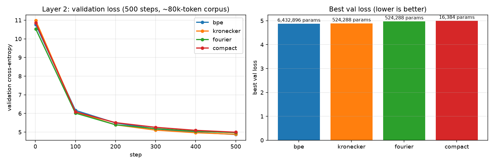
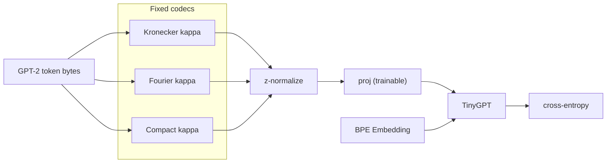

# Session 7: Fourier and Compact Byte-Local Codecs

[](https://github.com/rajiviyer/era-v5-session07-fourier-embedding-research/actions/workflows/ci.yml)

**Research question:** How should we encode within-token UTF-8 byte structure in a fixed,
low-dimensional space so geometry is useful before and during language-model training?

**Contribution:** A two-stage answer to Research Point #4.

1. **V2 (Fourier):** Replace Kronecker spikes with full-dimensional sin/cos waves at the
   same $D = d_c \times d_p$. Geometry matches the baseline (mean morph@5 $= 0.940$ at
   $d_p=16$).
2. **V3 (Compact bind):** Factor byte and position into separate waves, coupled by
   Hadamard product, at $D \ll d_c \times d_p$. Morph@5 reaches **0.950 to 0.960** at
   $D = 128$ (3.1% of Kronecker width) with **fewer trainable projection parameters**.

Both codecs are fixed before training; only
$\mathrm{proj}: \mathbb{R}^D \to \mathbb{R}^{d_{\mathrm{model}}}$ is learned. We verify
claims in two layers: **codec geometry probes** (no LM) and **tiny-GPT training** on real
text.

## One command

```bash
uv sync --group dev
uv run python main.py
```

Runs six geometry experiments on GPT-2 byte tables ($d_p=16$): pairwise cosines, morph@5,
compact dimension sweep, and Indic UTF-8 probes. Expect about 1 to 2 minutes on CPU for the
full vocabulary codec build.

Full research proof (train four embeddings on 80k-token English corpus, write `results/`):

```bash
python scripts/fetch_english_corpus.py   # once, if corpus_english.txt missing
uv run python train.py --all --steps 500 --eval-every 100 --plot
python scripts/plot_train_summary.py
```

Expect **about 12 min on CPU** for the full 4-way run (about 30 s with `--vocab-limit 1024`).

## Setup

Install [uv](https://docs.astral.sh/uv/), then from the repo root:

```bash
uv sync --group dev
uv run pytest tests/ -v
uv run python main.py
```

Runtime: `numpy`, `tiktoken`, `torch`. Dev: `pytest`, `matplotlib`. CI runs tests on
Python 3.11 and 3.12 (`.github/workflows/ci.yml`).

## Problem statement

Kronecker embeddings map each BPE token to a sparse vector $\kappa$ over a grid of
(byte, position) cells:

$$
\kappa_K(b) = \frac{1}{\sqrt{L}} \sum_{p=0}^{L-1} \mathbf{e}_{\,b_p \cdot d_p + p}
$$

where $\mathbf{e}_i$ is the $i$-th standard basis vector in $\mathbb{R}^D$ (a spike at
linear index $i = b_p \cdot d_p + p$).

Strong byte-local geometry, but $D = 256 \times d_p$ (4096 at $d_p=16$, 8192 at $d_p=32$).

**Central questions:**

> What is a *real* Fourier alternative to Kronecker? Can each byte be a Fourier wave,
> summed to form a word?

**Extension:** can factored sin/cos match that geometry at a fraction of $D$?

## Hypotheses and results

| ID | Hypothesis | Result ($d_p=16$, GPT-2 vocab) |
|----|------------|----------------------------------|
| H1 | Sin/cos waves at the same $\mathrm{lin\_idx}$ as Kronecker spikes preserve byte-local geometry | **Supported:** morph@5 0.940 (Fourier) vs 0.940 (Kronecker) |
| H2 | Dense Fourier $\kappa$ differs from sparse Kronecker $\kappa$ for the same string | **Supported:** low cross-codec cosine; probe scores still match |
| H3 | $\mathrm{byte\_wave}(b) \odot \mathrm{pos\_wave}(p)$ approximates Kronecker coupling in low $D$ | **Supported:** Compact bind morph@5 **0.960** at $D=128$ |
| H4 | Linear add of byte and position waves is insufficient at low $D$ | **Supported:** morph@5 0.880 at $D=256$ vs 0.950 (bind) |
| H5 | Codecs generalize to multibyte UTF-8 (Indic scripts) | **Supported:** prefix high, cross-script low (Experiment 6) |
| H6 | Fixed codecs support downstream LM training | **Supported:** val loss 10.8 → 4.87–4.99 over 500 steps on 78k-token English corpus |

Reproduce H1 to H5 with `uv run python main.py`. Reproduce H6 with `uv run python train.py --all`.

## Proof protocol

| Layer | Question | Command | Pass criterion |
|-------|----------|---------|----------------|
| 1 (Geometry) | Is $\kappa$ byte-local before any gradient step? | `uv run python main.py` | Typo, prefix, case, and cross-script probes; morph@5 at or above Kronecker for Compact bind |
| 2 (Tiny LM) | Does $\kappa$ structure help learning on text? | `uv run python train.py --all` | Val loss decreases; four embeddings trained under identical GPT and corpus |

### Layer 1: experiments

| # | Experiment | Output |
|---|------------|--------|
| 1 | Pairwise centered cosine | Kronecker vs Fourier on typos, case, prefixes, false semantics |
| 2 | NN neighbors of `run` | Top-5 tokens, loose morph@5 |
| 3 | Aggregate morph@5 | Mean over probe families (`run`, `compute`, `magnet`, `tion`) |
| 4 | Single-byte wave preview | First 16 dims of raw Fourier $\kappa$ |
| 5 | Compact dimension sweep | bind at $D \in \{64, 128, 256, 512, 1024\}$ vs Kronecker $D=4096$ |
| 6 | Indic UTF-8 probes | Devanagari/Tamil prefix, typo, `love` vs `प्रेम` |

### Layer 2: training

```bash
uv run python train_smoke.py --embedding kronecker          # 100-step sanity
uv run python train.py --embedding compact --steps 500 --eval-every 100
uv run python train.py --all --steps 500 --eval-every 100 --plot
uv run python train.py --all --corpus data/corpus_indic_sample.txt --steps 300 --eval-every 100
```

English and Indic corpora are evaluated **separately** (do not mix scripts in one ablation).

**Runtime (CPU, full GPT-2 vocab, measured on this repo):**

| Command | Corpus | Approx. time |
|---------|--------|-------------:|
| `train_smoke.py` (100 steps, one embedding) | random batch | ≈30 s |
| `train.py --embedding kronecker --steps 500` | 80k English | ≈3 min |
| `train.py --all --steps 500 --plot` | 80k English | **≈12 min** |
| `train.py --all --steps 500` | 1k smoke (`corpus_sample.txt`) | ≈5 min |
| `pytest tests/` | — | ≈30 s |

Most of the 4-way wall time is **500 training steps × 4 embeddings**. The Fourier codec
table build adds **60–90 s once** per run (Kronecker about 5 s, Compact about 20 s, BPE
negligible). Use `--vocab-limit 1024` for fast dev iterations (about 10× faster codec build).

### Layer 2: measured results

Command (reproduces figures in `docs/figures/`):

```bash
python scripts/fetch_english_corpus.py   # Gutenberg → data/corpus_english.txt (~80k tokens)
uv run python train.py --all --steps 500 --eval-every 100 --plot
python scripts/plot_train_summary.py
```

Quick smoke on the tiny Finn story (about 1k tokens): `--corpus data/corpus_sample.txt`.

Setup: `data/corpus_english.txt` (78,395 tokens after split), full GPT-2 vocab (50,257),
`d_model=128`, `seq_len=32`, `batch_size=16`, `d_p=16`, Compact $D=128$, CPU, seed 0.

| Embedding | Embed params | Best val loss | Val @ step 1 |
|-------------|-------------:|--------------:|-------------:|
| BPE | 6,432,896 | **4.872** | 10.757 |
| Kronecker | 524,288 | 4.886 | 10.978 |
| Fourier | 524,288 | 4.971 | 10.528 |
| Compact bind | 16,384 | 4.994 | 10.850 |

Val loss improves steadily through step 500 (no early overfitting on this corpus). BPE and
Kronecker edge Compact on raw val loss here, but Compact uses **32× fewer** projection
parameters than Kronecker and **393× fewer** than BPE; geometry probes (Layer 1) still favor
Compact bind at $D=128$. Matched-parameter LM ablation is future work.



Per-embedding curves: `docs/figures/train_{bpe,kronecker,fourier,compact}.png`.

## Measured geometry ($d_p=16$)

**Fourier vs Kronecker:** pairwise cosines nearly identical on standard probes; mean morph@5
$= 0.940$ both (`separate`/`seperate` $= 0.875$; `love`/`affection` low).

**Compact bind sweep:**

| Codec | $D$ | % of Kronecker $D$ | mean morph@5 |
|-------|-----|--------------------|----------------|
| Kronecker | 4096 | 100% | 0.940 |
| Compact bind | 128 | 3.1% | **0.960** |
| Compact bind | 256 | 6.2% | 0.950 |
| Compact bind | 512 | 12.5% | 0.950 |
| Compact add | 256 | 6.2% | 0.880 |

**Indic (Experiment 6):** `love`/`प्रेम` cosine $\approx 0$; `भारत`/`भारती` $\approx 0.89$
(Kronecker/Fourier), $\approx 0.94$ (Compact bind).

## Codec definitions

**Kronecker (baseline):**

$$
\kappa_K[\,b \cdot d_p + p\,] \mathrel{+}= \frac{1}{\sqrt{L}}
\qquad\Longrightarrow\qquad
\kappa \leftarrow \mathrm{z\_norm}(\kappa_K)
$$

**Fourier V2** (same $D$; $\mathrm{lin\_idx} = b \cdot d_p + p$):

$$
\kappa_F(j) \mathrel{+}= \frac{1}{\sqrt{L}} \cdot
\frac{\cos\!\left(\dfrac{2\pi j \cdot \mathrm{lin\_idx}}{D}\right)
      + \sin\!\left(\dfrac{2\pi j \cdot \mathrm{lin\_idx}}{D}\right)}{\sqrt{2}}
$$

**Compact V3 bind** (independent $D$, typically 128 to 512):

$$
\varphi(b, p) = \mathrm{byte\_wave}(b) \odot \mathrm{pos\_wave}(p)
$$

$$
\kappa_C = \mathrm{z\_norm}\!\left( \frac{1}{\sqrt{L}} \sum_{p=0}^{L-1} \varphi(b_p, p) \right)
$$

with $\mathrm{byte\_wave}$ and $\mathrm{pos\_wave}$ each a unit-norm sin/cos vector over
$j = 0, \ldots, D-1$ keyed by byte value and within-token position respectively.

## Architecture



## Subsystem map

| Component | File |
|-----------|------|
| Kronecker codec | `codec.py` |
| Fourier codec | `fourier_codec.py` |
| Compact codec | `compact_codec.py` |
| Byte tables | `byte_table.py` |
| Geometry probes | `probes/neighbors.py` |
| Experiments | `playground_v2_fourier.py`, `main.py` |
| PyTorch embeddings | `embedding.py` |
| Tiny LM | `tiny_gpt.py` |
| Training | `train.py`, `train_smoke.py` |
| Corpora | `data/corpus_english.txt` (default), `data/corpus_sample.txt` (quick), `data/corpus_indic_sample.txt` |
| Corpus scripts | `scripts/fetch_english_corpus.py`, `scripts/write_indic_corpus.py` |
| Tests | `tests/` (34 cases) |

## Design decisions

| ID | Decision | Rationale |
|----|----------|-----------|
| D1 | V2 keeps $D = d_c \times d_p$ | Isolates basis change from dimension change |
| D2 | V3 default is Hadamard bind ($\odot$) | Preserves byte $\times$ position coupling; add fails at low $D$ |
| D3 | Fixed $\kappa$, learned $\mathrm{proj}$ only | Matches Kronecker embedding contract |
| D4 | GPT-2 + `tiktoken` byte paths | Real BPE fragments and UTF-8 multibyte tokens |
| D5 | Separate English and Indic corpora | Avoids confounded val-loss comparisons |
| D6 | morph@5 as primary geometry metric | Standard byte-locality probe from Kronecker literature |
| D7 | Tiny GPT for Layer 2 | Validates training path on real text; not a scaling study |
| D8 | Default LM corpus ≈80k tokens | Gutenberg English prose; stable val curves vs 1k-token smoke |

## Tests

```bash
uv run pytest tests/ -v
```

34 tests, CPU only, no GPU, no network: codec invariants, full-vocab matrix smoke, 100-step
train for all four embeddings, Indic probes, short `train.py` run.

## Artifacts

```text
results/                     # gitignored; created by train.py
  train_{bpe,kronecker,fourier,compact}.csv
  train_summary.json
  train_*.png                # with --plot

docs/figures/                # committed; README figures
  train_ablation_summary.png
  train_{bpe,kronecker,fourier,compact}.png
```

## Documentation

| Document | Content |
|----------|---------|
| [docs/v2-fourier-alternative.md](docs/v2-fourier-alternative.md) | V2 detail |
| [docs/v3-compact-codec.md](docs/v3-compact-codec.md) | V3 bind vs add |
| [docs/pen-and-paper-walkthrough_kronecker_vs_fourier_vs_compact.md](docs/pen-and-paper-walkthrough_kronecker_vs_fourier_vs_compact.md) | Toy matrices |
| [docs/figures/](docs/figures/) | Layer 2 training curves |

## Limitations

- Tiny GPT (about 1M parameters), short corpora, hundreds of steps: validates the training path,
  not LM competitiveness.
- morph@5 is a geometry proxy, not downstream task accuracy.
- Compact **add** mode underperforms bind; included as a negative baseline only.
- Equal-parameter LM ablation at scale, collision theory, and learnable spectra are future
  work (see below).

## Future work

- LM ablation at matched embedding-parameter budget (Compact $D=128$ vs Kronecker $D=4096$)
- Interference and collision bounds for factored encodings
- Learnable frequencies on fixed superposition structure
- Position handling beyond fixed $d_p$

## References

- [Kronecker Embeddings (V1)](https://github.com/rajiviyer/kronecker-embedding-research)
